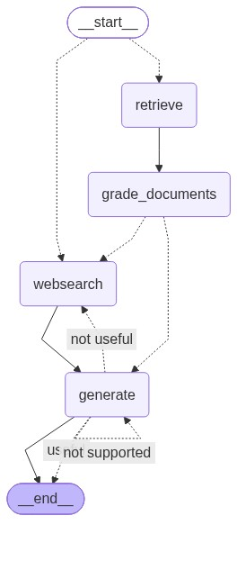

# Corrective RAG (CRAG)

LangGraph ile kurulmuş bir **Corrective RAG** akışı. Soru önce doğru kaynağa yönlendirilir, getirilen dokümanlar LLM ile puanlanır, yetersiz kalırsa web araması yapılır ve üretilen cevap hem dokümanlara dayanıp dayanmadığı hem de soruyu yanıtlayıp yanıtlamadığı açısından kontrol edilir.



## Akış

1. **Route question** – `question_router` soruyu vector store'a (agent, prompt engineering, adversarial attack konuları) ya da web aramasına yönlendirir.
2. **Retrieve** – Chroma vector store'dan ilgili parçalar getirilir.
3. **Grade documents** – `retrieval_grader` her dokümanı soruyla alakasına göre `yes/no` puanlar. Alakasız doküman varsa elenir ve web araması işaretlenir.
4. **Web search** – Tavily ile arama yapılır, sonuçlar `Document` olarak listeye eklenir.
5. **Generate** – Dokümanlar context olarak verilip cevap üretilir.
6. **Kontroller**
   - `hallucination_grader`: cevap dokümanlara dayanmıyorsa → tekrar **generate**
   - `answer_grader`: cevap soruyu karşılamıyorsa → **web search**, karşılıyorsa → **END**

## Proje yapısı

```
CorrectiveRAGProject/
├── ingestion.py            # Lilian Weng blog yazılarını yükler, böler, Chroma'ya yazar; retriever
├── main.py                 # Grafı örnek bir soruyla çalıştırır
├── graph.png               # Grafın Mermaid çizimi
└── graph/
    ├── graph.py            # StateGraph tanımı, koşullu kenarlar
    ├── state.py            # GraphState
    ├── node_constants.py   # Düğüm isimleri
    ├── chains/             # router, retrieval/hallucination/answer grader'lar, generation
    └── nodes/              # retrieve, grade_documents, web_search, generate
```

## Kurulum

```bash
cd CorrectiveRAGProject
python3 -m venv .venv
source .venv/bin/activate
pip install -r requirements.txt
cp .env.example .env   # OPENAI_API_KEY ve TAVILY_API_KEY değerlerini girin
```

## Çalıştırma

```bash
python main.py
```

Grafın görselini yeniden üretmek için `graph/graph.py` sonundaki satırı açın:

```python
app.get_graph().draw_mermaid_png(output_file_path="graph.png")
```
